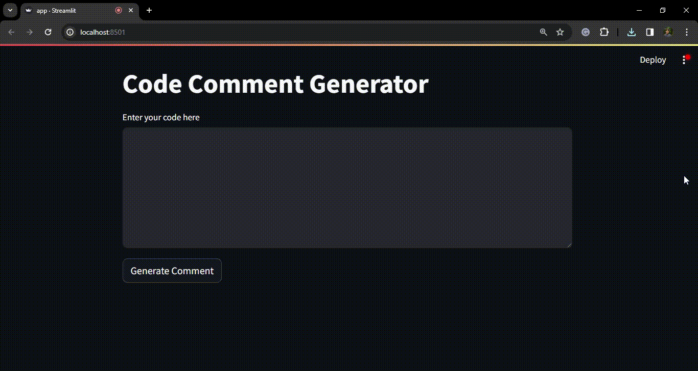

# Code-Comment-Generator
This project was created using Cohere Generate model to generate comments to codes that are given as input. This app is coded in python and hosted using streamlit platform.

##Introduction
Comments in coding are lines within the source code that are not executed by the compiler but serve as human-readable explanations or documentation for the code. They play a crucial role in enhancing code comprehension, facilitating collaboration, easing onboarding for new developers, and streamlining code review and debugging.

Despite their importance, many developers do not consistently comment on their code for various reasons. This code comment generator aims to address this issue by automatically generating relevant comments for a given code.

## Benefits of Comments
- Improved documentation quality.
- Reduced developer workload.
- Enhanced collaboration.
- Adherence to coding standards.

### Step 1: Install and Import Dependencies

If you are using Python, install Cohere and Streamlit using the following pip commands:
```bash
pip install cohere
pip install streamlit
```
Import them into your app.py file:

```python
import cohere
import streamlit as st
```
### Step 2: Set Cohere API Key

Set your Cohere API Key in app.py or use an environment file to save your key:
```python
co = cohere.Client('Enter your COHERE API KEY')
```

### Step 3: Get User Input
Get the code as user input:

```python
user_input = st.text_area("Enter your code here")
```
### Step 4: Add Information about Comments
Add information about comments along with the user input code:

```python
add_info = '''
In computer programming, a comment is a programmer-readable explanation or annotation in the source code of a computer program. They are added with the purpose of making the source code easier for humans to understand, and are generally ignored by compilers and interpreters.

give a comment line for this code and nothing more
'''
prompt = user_input + add_info
```

### Step 5: Use Cohere Command Model

Give the prompt as input to the Cohere command model:

```python
if st.button('Generate Comment'):
    response = co.generate(
        model='command',
        prompt=prompt,
        max_tokens=1376,
        temperature=0.9,
        k=0,
        stop_sequences=[],
        return_likelihoods='NONE'
    )
```
### Step 6: Display Generated Comment

Display the generated comment:
```python
st.text('Comment: {}'.format(response.generations[0].text))
```

### Running the Application
To run this code on your local machine, use the following command in your terminal:

```bash
streamlit run app.py
```
View your Streamlit app in your browser using the Local URL: http://localhost:8501




